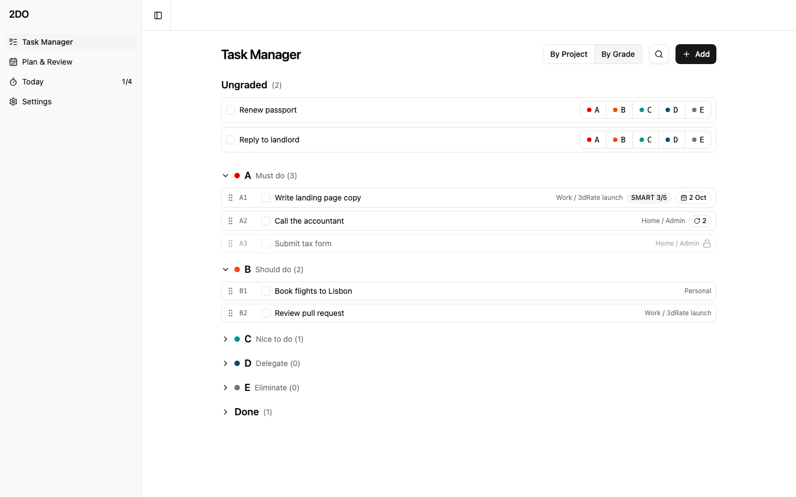
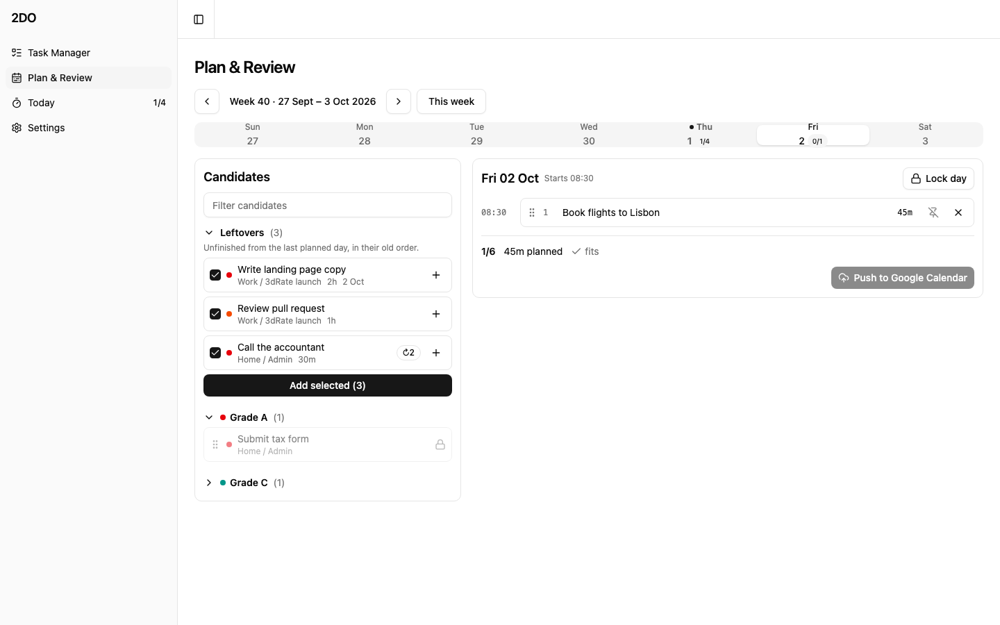
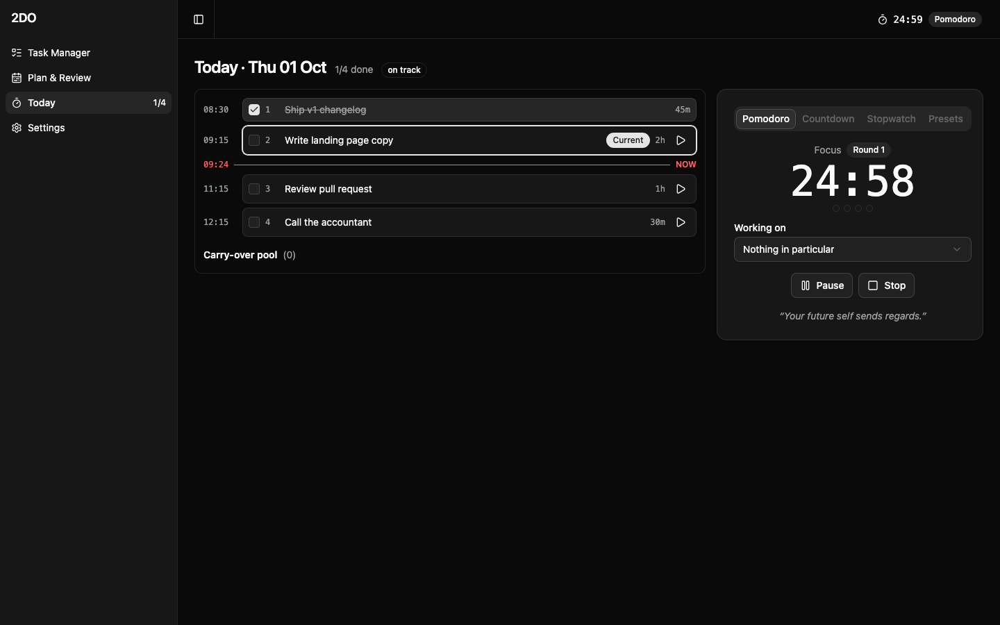
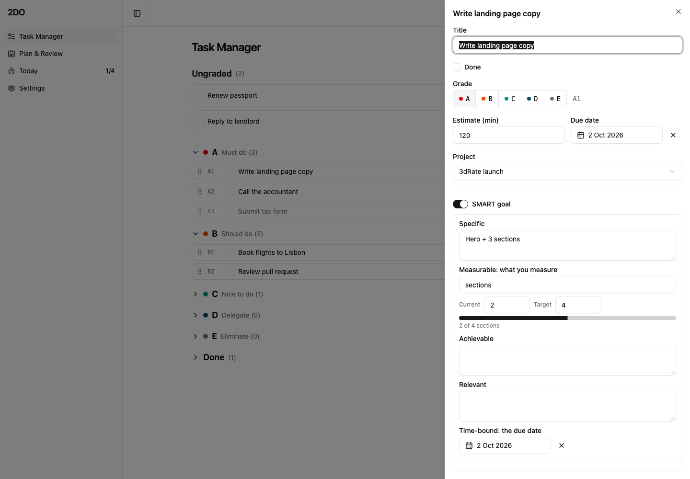
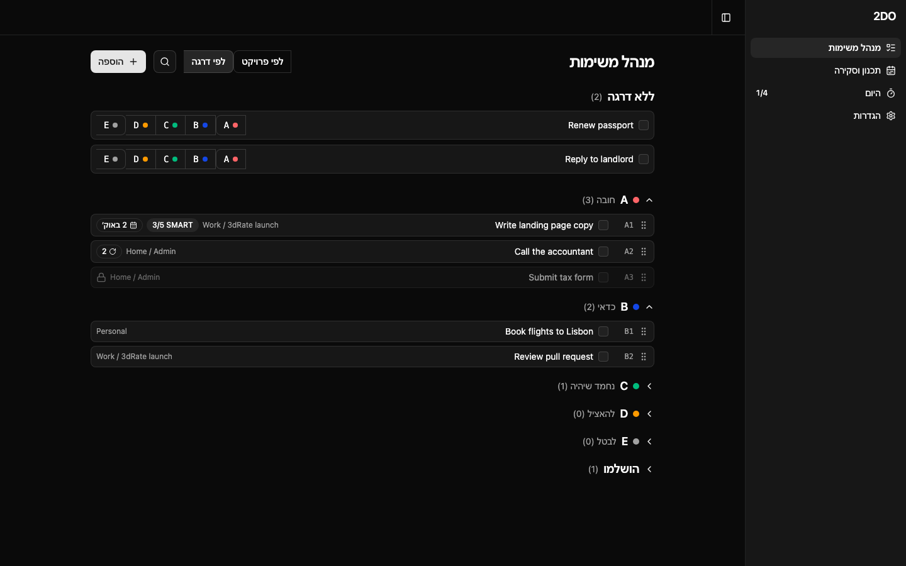

# 2DO: a daily time-management system

A personal planner that turns a to-do list into a daily routine. It is built on four ideas from a time-management course: **ABCDE** prioritization, the **Ivy Lee** six-item day, **Pomodoro-style focus timing**, and a **weekly review**. Everything runs in the browser, in English and Hebrew (full RTL), light and dark.



## What it does

- **Capture and grade.** Quick add with `⌘⇧A`, search with `⌘K`. Every task and subtask gets an A–E grade and a drag-to-reorder rank. New items wait in an Ungraded inbox. Areas, projects and tasks, with optional SMART goals (measurable progress bar), checklists, links, and "waiting on" dependencies.
- **Plan tomorrow tonight.** Pick up to six leaf items, set estimates, and the day auto-stacks from your start time around fixed blocks. Pin blocks to a time, reorder by dragging, lock a day, and see capacity and overflow at a glance. Unfinished items from the last day are offered first.
- **Run the day.** A Today screen with a live "now" line, a drift indicator (minutes behind or ahead), tick-off with order nudges, and a timer with Pomodoro, countdown, stopwatch and custom presets. The timer survives reloads and logs focus sessions per task.
- **Review the week.** On the review day a block is inserted automatically. The review shows a scorecard, walks active projects (progress, re-grade, carried-over items) and keeps a reflection per week.
- **Google Calendar.** Optionally reads your busy events onto the timelines and pushes the plan to a dedicated "2DO" calendar, with auto or manual sync.

| Plan & Review | Today and timer (dark) |
|---|---|
|  |  |
| **Item detail** | **Hebrew, RTL, dark** |
|  |  |

## Tech

React 19, TypeScript, Vite, Tailwind CSS v4, shadcn/ui (new-york, neutral), React Router, dnd-kit. State is a reactive `localStorage` store read through `useSyncExternalStore`, behind a backend-agnostic mutation layer so a server adapter can replace it later. Google Calendar uses Google Identity Services in the browser, with no backend.

## Engineering notes

- **Pure domain core.** `src/domain` holds every rule (scheduler, caps, leftovers, scoring, week math, drift, reminders) with no React imports, and is unit-tested first.
- **Mutations are pure reducers** `(db, ...args) => db`, bound to the store, so rules are testable without a UI.
- **Timer as a state machine** derived from timestamps, so reloads and background tabs stay correct.
- **Google client behind an interface** with a real REST client, an in-memory mock, and a tested sync diff (create, update, delete).
- **Tests:** ~290 unit and component tests (Vitest, Testing Library) and 22 Playwright end-to-end tests, including a full capture → plan → tick → review journey, Google endpoints stubbed, and an axe accessibility scan in both languages and themes.
- **Planned in the open.** The whole v2 was built phase by phase from a written spec, one branch per phase merged with `--no-ff`; the per-phase plans are in [`docs/plans`](docs/plans) and the branch history shows the order of work.
- **First-run tour.** A new visitor gets a five-step walkthrough and can load sample data to explore (replay it from Settings).

## Run it

```bash
npm install
npm run dev        # http://localhost:5173
npm run build
npm run lint
npm test           # Vitest
npx playwright install chromium   # first time only
npm run test:e2e   # Playwright (own dev server on :5199)
```

Data lives in your browser (`localStorage`, key `2do.db.v2`). On first launch a short tour offers sample data so you can click around right away.

## Google Calendar setup (optional)

1. In Google Cloud Console create a project and enable the **Google Calendar API**.
2. Configure the OAuth consent screen (External, add yourself as a test user).
3. Create an **OAuth client ID** of type **Web application** with `http://localhost:5173` as an authorized JavaScript origin.
4. Copy `.env.example` to `.env.local` and set `VITE_GOOGLE_CLIENT_ID`.
5. Restart `npm run dev`, then Settings → Connect Google Calendar.

Scopes: read calendar list, read events, and manage only the calendar the app creates.

## Project layout

```
src/domain        pure rules and their tests
src/data          store, persistence, pure mutations
src/timer         timer state machine and alerts
src/integrations  Google Calendar client, sync diff, service
src/screens       Task Manager, Plan & Review, Today, Settings
src/components    shell, detail panels, timeline, pickers (shadcn/ui in components/ui)
src/i18n          EN/HE catalogs and RTL support
e2e               Playwright specs
docs/plans        phase-by-phase build plans
```

v1 (a simpler task store) is preserved at the `v1` tag.

## License

[MIT](LICENSE) © Erez Cohen
